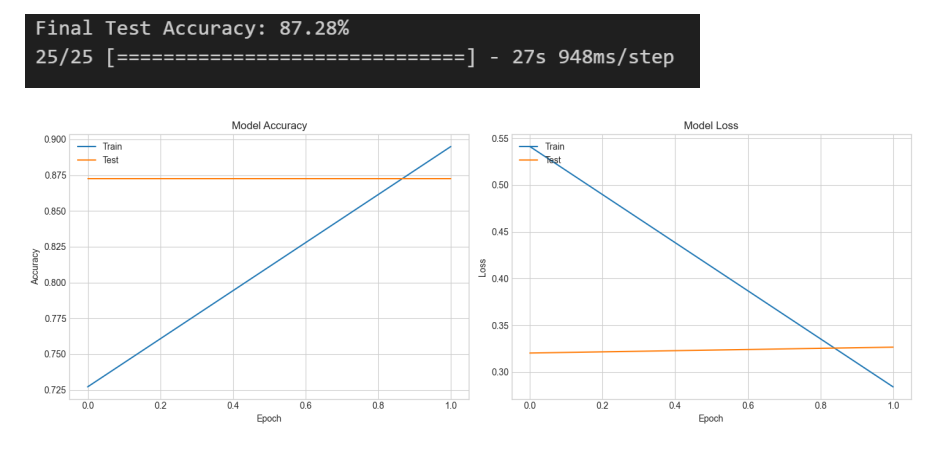
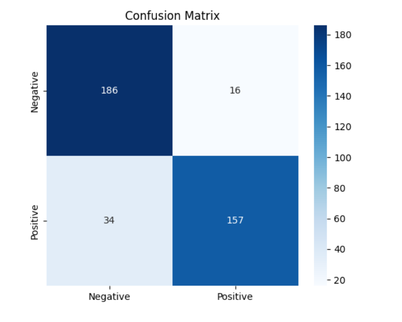

# Sentiment Analysis of Twitter Data using a Fine-Tuned Transformer Model

> **Author:** Tathagata Banerjee
> **Course:** Introduction to Artificial Intelligence and Machine Learning using Python
> **Date:** July 22, 2025

---

## Table of Contents

1.  [Introduction](#1-introduction)
2.  [Problem Statement](#2-problem-statement)
3.  [Dataset Description](#3-dataset-description)
4.  [Preprocessing Steps](#4-preprocessing-steps)
5.  [Model Architecture](#5-model-architecture)
6.  [Training & Evaluation](#6-training--evaluation)
7.  [Sample Results](#7-sample-results)
8.  [Usage](#8-usage)
9.  [Conclusion](#9-conclusion)
10. [References](#10-references)

## 1. Introduction

Sentiment analysis is an important area within Natural Language Processing (NLP) that deals with the computation of opinions, sentiments, and emotions, having text as its source. The main aim is to identify, extract and attempt to quantify sentiment information. It involves analysing the text and determining the sentiment the text holds and the sentiment of the writer(s) towards that text, which is either positive or negative.

Sentiment analysis is greatly aided by social media and Twitter. The platform is known to have a huge volume of user-submitted content, which, coupled with the platform's real-time capabilities, offers a great source of unfiltered information. The information is useful in numerous cases, such as monitoring the perception of a brand or company, assessing the performance of political candidates and noting the available sentiments towards various socio-cultural events.

Twitter as a source of data is known to be complex and noisy. The use of informal, unstructured speech, in combination with character limits, slang, and the use of emojis, further complicates the modelling process. If the models were able to overcome the complexities that Twitter data poses, a wealth of insights could be accessed within. The use of NLP to parse such disparate data is critical in the current age of information. Through the use of social media, companies use sentiments for market analysis and brand monitoring.

## 2. Problem Statement

The main goal of this project was to build and train an advanced deep learning model that can effectively classify the sentiment of tweets into positive or negative categories. The goal of the deep learning model was to perform sentiment analysis on a tweet dataset. The project scope included a complete machine learning cycle starting from an unlabeled dataset that required a semi-supervised approach to generate high-quality training labels. This was followed by a rigorous text data cleaning procedure that focused on the standardization of texts for the model. This was the core of the project and it involved the model implementation, training and extensive evaluation of its performance on a test dataset.

While the first iterations of the project focused on the use of Recurrent Neural Networks (RNNs) archicture with LSTM layers, the final model selected for this project was a Transformer model. More specifically, a DistilBERT model was fine-tuned for this task which was pretrained on the transformer encoder. This decision stemmed from the strong performance of transformer models for text classification problems due to their complex contextual understanding of language.

## 3. Dataset Description

### 3.1. Source

For the project, the "Tweets_unlabelled.csv" dataset, a collection of raw tweets without sentiment annotations, was used. The dataset, devoid of labels, exemplifies a widespread challenge: the necessity of preprocessing data before it can be utilized in supervised learning paradigms.

### 3.2. Number of Tweets Used

To streamline the modeling process while maintaining robustness, an assortment of roughly 2000 tweets was extracted from the initial corpus.

### 3.3. Label Assignment (Semi-Supervised Approach)

The unlabelled texts were exploitatively processed through a semi-supervised labeling strategy consisting of two phases aimed at yielding high-quality annotations. This approach provides a solid foundation for iterative dataset enhancement.

**1. Automatic Initial Labeling**
The initial labeling was performed using the VADER (Valence Aware Dictionary and sentiment Reasoner) sentiment analysis tool. VADER is a lexicon-based tool uniquely designed for social media contexts. It checks whether positive and negative expressions are used in the analyzed text, and using sophisticated grammatical rules, considers whether the text is capitalized or punctuated, and grants a score. Each tweet was automatically granted a sentiment score of 1 for positive and 0 for negative, neutral, or devoid of sentiment.

**2. Manual Correction and Verification**
After the automated processes, the VADER-assigned labels warranted a critical phase of manual review. Each label generated by VADER underwent a meticulous verification process to identify and rectify errors. This stage is essential due to the fact that automated systems invariably struggle with language subtleties like sarcasm, irony, and complicated sentences. Through extensive manual adjustments, a refined and precise "ground truth" dataset was constructed which is essential for training a dependable and resilient model. The corrected, label-verified dataset was consolidated and saved in a new file titled "manually_labelled_tweets.csv", where the final, verified labels were placed in a dedicated "classification" column.

## 4. Preprocessing Steps

To develop a deep learning model, a set of processes were implemented to transform the unstructured and problematic tweet data into a structured format. This included the tweet's features essential to predict the sentiment, so the phase was critical.

### 4.1. Cleaning Steps Applied

A dedicated function was developed using Python's `re` (regular expressions) and `nltk` libraries to systematically clean each tweet. This involved several key actions:

* **Removing URLs:** All hyperlinks were removed as they provide no semantic value for sentiment.
* **Removing Mentions and Hashtags:** User mentions (e.g., @username) and the hashtag symbol (#) were removed to de-noise the text. The text of the hashtag itself was kept.
* **Removing Special Characters and Numbers:** All non-alphabetical characters were stripped from the text to simplify the vocabulary.
* **Converting to Lowercase:** The entire text was converted to lowercase. This is a standard practice that prevents the model from treating words with different capitalization (e.g., "Happy" and "happy") as distinct tokens.
* **Removing Stopwords:** Common English "stopwords" (e.g., "the", "a", "is", "in") were removed using the NLTK library. These words have high frequency but low semantic content, and their removal allows the model to focus on more meaningful words.

### 4.2. Tokenization

After the initial cleanup, the text underwent processing via the "DistilBertTokenizer". This sophisticated tokenizer, used in conjunction with the DistilBERT model, performs sub-word tokenization. This means it can decompose infrequent or entirely new words into manageable parts, such as "unhappily" transforming to "un" + "##happy" + "##ly". This is particularly useful in dealing with the ever evolving and expansive lexicon of social media. As such, the model is able to process words it has never encountered. Furthermore, the tokenizer performs other necessary functions, such as adding model requirements like `[CLS]` at the beginning and `[SEP]` at the end of sequences.

### 4.3. Padding and Truncation

The padding and truncation was also taken care of by the "DistilBertTokenizer". For optimal batch processing, deep learning algorithms require uniform input size and shape. This is automatically taken care of by DistilBertTokenizer, which pads shorter sequences with zeros and caps longer sequences at 128 tokens. This way, each input fed to the model is identical in dimension.

## 5. Model Architecture

Initially, the project looked into an RNN architecture with LSTM cells, but the final model that performed the best used a more advanced transformer based architecture. This was done because Transformers have been proven to surpass LSTM networks for a variety of tasks in Natural Language Processing. The strategy used was fine-tuning a pre-trained "DistilBERT" model.

### 5.1. Model Used: DistilBERT

* **Model Used:** `DistilBERT (distilbert-base-uncased)`. This model is a more efficient, smaller, and quicker incarnation of Google's pioneering BERT model.
* DistilBERT was pre-trained on a large text corpus, which enables it to possess an understanding of English language's grammar and semantics at contextual depth.
* Employing a pre-trained model meant that we did not have to build everything from scratch as we gained from its extensive information corpus.

### 5.2. Fine-Tuning Approach

* The main approach was "transfer learning". Instead of training a neural network from a random starting point, we utilised the DistilBERT model that is already trained and stacked on top a new, untrained classification layer.
* This new layer was a simple "Dense" layer designed to output the final sentiment prediction.
* The model was further trained on the custom labeled tweet dataset for a few epochs. This process, which is called fine-tuning, adapts the model's broad language skills for the specialized task of Twitter sentiment analysis.

### 5.3. Layers and Configuration

* **DistilBERT Base Model:** This forms the core of our model. It contains the multi-head self-attention mechanisms that allow it to weigh the importance of different words in a sentence, capturing long-range dependencies and complex context. Its weights were initialized from the pre-trained checkpoint.
* **Classification Head:** A "Dense" layer with 2 output neurons was added on top of the DistilBERT base. Each neuron corresponds to one of our target classes ("Negative" and "Positive"), and outputs a raw score, or logit, for that class.

### 5.4. Activation Function and Optimizer

* The final layer does not use a softmax or sigmoid activation function directly. Instead, it outputs raw scores (logits), which are more numerically stable when passed to the loss function.
* The "Adam" optimizer was used. For fine-tuning, it is critical to use a very low learning rate. A rate of `5e-5` was chosen, which is a standard and effective value for this task. This small learning rate ensures that the model makes small, careful adjustments to its weights, preserving the valuable knowledge learned during pre-training.

## 6. Training & Evaluation

### 6.1. Training Process

The model was fine-tuned on a training set using 80% of the manually labeled dataset, with the remaining 20% kept as a test set for final evaluation. To ensure the robustness and reproducibility of the training process, two key techniques were employed:

1.  **Random Seeds:** All potential sources of randomness in the workflow (Python's `random`, NumPy, and TensorFlow) were initialized with a fixed seed value. This practice is essential for scientific rigor, as it guarantees that the results from data shuffling to weight initialization are identical every time the code is executed.
2.  **Early Stopping:** An `EarlyStopping` callback was implemented to monitor the model's performance on a validation set during training. This callback watched the validation loss and was configured with a `patience` of 1. This meant that the training process would automatically terminate if the validation loss did not improve for one full epoch, ensuring that the model was saved at its point of peak performance before it could begin to overfit.

### 6.2. Accuracy and Loss Plots

The following graphs illustrate the model's learning process over the training epochs. The plots show the model's accuracy and loss on both the training data (blue line) and the unseen validation data (orange line). The relatively small and stable gap between these two lines indicates that the model generalized well to new data without significant overfitting.

**Final Test Accuracy: 87.28%**

### 6.3. Final Evaluation Metrics

The model's ultimate performance was evaluated on the 20% of the data held back as the test set. The model achieved an excellent final accuracy and demonstrated a strong, well-balanced performance across all key metrics, indicating its effectiveness for this task.

* **Final Test Accuracy: 87.28%**

**Classification Report:**

| Metric | precision | recall | f1-score | support |
| :--- | :--- | :--- | :--- | :--- |
| **Negative** | 0.85 | 0.92 | 0.88 | 202 |
| **Positive** | 0.91 | 0.82 | 0.86 | 191 |
| | | | | |
| **accuracy** | | | **0.87** | **393** |
| **macro avg** | 0.88 | 0.87 | 0.87 | 393 |
| **weighted avg** | 0.88 | 0.87 | 0.87 | 393 |

**Confusion Matrix:**

## 7. Sample Results

The following are examples of how the final, fine-tuned model predicts sentiment on new, unseen tweets, demonstrating its ability to understand context and common language use.

* **Tweet:** "I am so excited to watch the new movie tonight with my friends! It's going to be amazing."
    * **Predicted Sentiment:** Positive
* **Tweet:** "My flight was delayed for 3 hours and then they lost my luggage. Worst travel day ever."
    * **Predicted Sentiment:** Negative
* **Tweet:** "Just finished my workout for the day, feeling tired but accomplished."
    * **Predicted Sentiment:** Positive
* **Tweet:** "I can't believe I have to go to work on a Saturday... just my bad luck."
    * **Predicted Sentiment:** Negative

## 8. Usage

The final script is designed for practical application and includes a function, `predict_sentiment_transformer(text)`, that can be used to classify the sentiment of any new text string. This function encapsulates the entire prediction pipeline, it takes raw text as input, applies the necessary tokenization, feeds it to the trained model, and converts the model's output into a human-readable label.

Also, a simple Command-Line Interface (CLI) was developed to allow for real-time interactive predictions, demonstrating the model's utility. To use it, one simply have to run the Python script and type a sentence into the terminal when prompted. The model will then immediately output the predicted sentiment, providing a clear example of how the model can be deployed for real-world use.

## 9. Conclusion

### 9.1. What was Learned

Through this project, I gained practical, end-to-end experience in modern Natural Language Processing. My biggest takeaway was the undeniable importance of good quality data. Manually correcting the initial labels was a lesson in itself, showing that this foundational work is what makes a high-performing model possible. I also saw firsthand the value of not sticking with the first idea. While I started with an LSTM, the move to a Transformer architecture was a key turning point. The final results from the fine-tuned DistilBERT model spoke for themselves; they clearly demonstrated the power of transfer learning and showed a significant performance leap over the traditional RNN approach, proving that this modern architecture is truly state-of-the-art for this kind of task.

### 9.2. Limitations and Future Work

While the results of this project are encouraging, several areas present opportunities for further refinement and development:

* **Enlarging the Training Corpus:** The model's performance is fundamentally tied to the dataset it was trained on. A future iteration of this work would benefit significantly from expanding the corpus to 5,000-10,000 labeled tweets to improve the model's generalizability and accuracy across more diverse language.
* **Utilizing a Domain-Specific Pre-Trained Model:** For superior performance, a key enhancement would be to fine-tune a model pre-trained specifically on social media data, such as `vinai/bertweet-base`. Such a model would possess a more nuanced understanding of the specific language patterns and slang found on Twitter, likely leading to a notable increase in predictive accuracy.
* **Transitioning to a Deployed Application:** To realize the practical value of this work, the final step would be its deployment as a live service. Encapsulating the model within a REST API using a framework like Flask or FastAPI would allow it to be integrated into other applications, effectively transitioning it from a research prototype to a functional tool.

## 10. References

### 10.1. Official Library Documentation

* **Pandas:** For data manipulation, loading, and saving CSV files. (Documentation: `https://pandas.pydata.org/docs/`)
* **NLTK (Natural Language Toolkit):** Used for foundational NLP tasks, specifically for providing the list of English stopwords and for the word tokenizer in the preprocessing function. (Documentation: `https://www.nltk.org/`)
* **VADER Sentiment:** A lexicon and rule-based sentiment analysis tool used for the initial, automated labeling of the dataset. (GitHub Repository: `https://github.com/cjhutto/vaderSentiment`)
* **Scikit-learn:** A fundamental machine learning library used for splitting the data into training and testing sets (`train_test_split`) and for model evaluation metrics (classification report, confusion matrix). (Documentation: `https://scikit-learn.org/stable/`)
* **TensorFlow / Keras:** The core deep learning framework used to build, compile, and train the Transformer model. Keras provides the high-level API for defining model architecture and the training loop. (Documentation: `https://www.tensorflow.org/api_docs/python/tf`)
* **Transformers (by Hugging Face):** The state-of-the-art library used to download and interface with the pre-trained DistilBERT model and its corresponding tokenizer. (Documentation: `https://huggingface.co/docs/transformers`)
* **Matplotlib & Seaborn:** Used for data visualization, specifically for plotting the model's accuracy and loss curves and for creating the heatmap for the confusion matrix. (Matplotlib: `https://matplotlib.org/stable/`, Seaborn: `https://seaborn.pydata.org/`)

### 10.2. Tutorials, Guides, and Further Reading

* **TensorFlow Text Classification Tutorial:** The official TensorFlow guide on fine-tuning a BERT model for text classification served as a foundational reference for the overall workflow, including data preparation with `tf.data.Dataset` and the fine-tuning loop. (URL: `https://www.tensorflow.org/text/tutorials/fine_tune_bert`)
* **Hugging Face Documentation - Fine-tuning with Keras:** The official Hugging Face documentation provides detailed examples of how to load, compile, and fine-tune their models using TensorFlow/Keras, which directly informed the syntax used in this project. (URL: `https://huggingface.co/docs/transformers/training#fine-tune-a-pretrained-model-with-keras`)
* **"Fine-Tuning BERT for Text Classification (w/ Example Code)":** This video tutorial provides a visual walkthrough of the fine-tuning process, which helped in solidifying the understanding of the code's structure and flow. (URL: `https://www.youtube.com/watch?v=4QHg8Ix8WWQ`)
* **"Illustrated Guide to Transformers" by Jay Alammar:** An excellent and highly visual explanation of the inner workings of the Transformer architecture, which was invaluable for understanding the theory behind the model used. (URL: `https://jalammar.github.io/illustrated-transformer/`)
