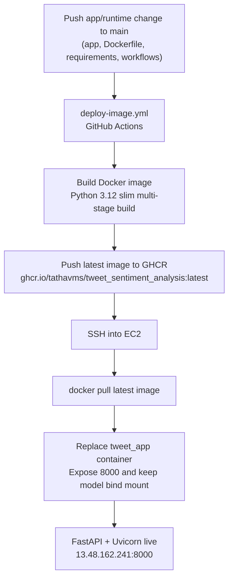
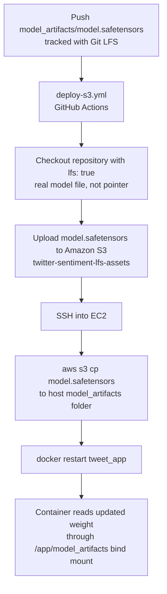

# Tweet Sentiment Analysis Platform

A production-grade, end-to-end Machine Learning web application that classifies text sentiment into **Positive** or **Negative** categories. The application uses a fine-tuned **Hugging Face DistilBERT** model implemented with **PyTorch**, served through **FastAPI**, containerized with **Docker**, and deployed to AWS EC2 through automated **GitHub Actions CI/CD**.

## Live Service & Metrics

* **Live App URL:** [http://13.48.162.241:8000](http://13.48.162.241:8000)
* **Final Production Accuracy:** **90.84%**
* **Production Runtime:** Dockerized FastAPI service on AWS EC2 with model weights supplied through a secure S3-backed bind mount.

> **Author:** Tathagata Banerjee

---

## 1. Problem Statement

The goal of this project was to build an end-to-end sentiment analysis system that can classify tweet-style text into positive or negative sentiment. The project covers the full ML lifecycle: data preparation, text cleaning, model experimentation, transformer fine-tuning, evaluation, packaging, and cloud deployment.

Earlier iterations explored recurrent neural networks with LSTM layers. The final production model uses **DistilBERT**, a lightweight transformer encoder that gives stronger contextual understanding while remaining practical for CPU-only inference on a small EC2 instance.

---

## 2. End-to-End System Architecture

The current architecture separates lightweight application code from the large transformer weight file. Application changes rebuild and redeploy the Docker image. Model-weight changes sync the Git LFS asset to Amazon S3, hydrate the EC2 host file, and restart the running container with the refreshed weight mounted into `/app/model_artifacts/model.safetensors`.

```text
GitHub main branch
|
+-- App/runtime change
|   `-- deploy-image.yml
|       `-- Docker multi-stage build
|           `-- GitHub Container Registry
|               `-- SSH to EC2: docker pull + replace tweet_app
|
`-- model_artifacts/model.safetensors change
    `-- deploy-s3.yml
        `-- checkout with Git LFS
            `-- upload weight file to Amazon S3
                `-- SSH to EC2: aws s3 cp + docker restart tweet_app

AWS EC2 production host
|
+-- /home/ec2-user/tweet_sentiment_analysis/model_artifacts/model.safetensors
|   `-- bind-mounted into the container at /app/model_artifacts/model.safetensors
|
`-- tweet_app Docker container
    `-- FastAPI + Uvicorn on port 8000 -> Elastic IP public endpoint
```

**Application Image Deployment**



**Model Weight Deployment**



### 2.1 Architecture Highlights

* **Two-lane CI/CD:** `deploy-image.yml` handles application and runtime changes. `deploy-s3.yml` handles pushes that include `model_artifacts/model.safetensors` updates.
* **Slim production image:** The Dockerfile copies FastAPI code and small Hugging Face metadata into the runtime image, but intentionally excludes the 267 MB model weight file.
* **Externalized model weight:** The large `.safetensors` file is tracked with Git LFS, copied to S3, pulled onto EC2, and mounted into the container at runtime.
* **CPU-first inference:** `requirements.txt` pins CPU PyTorch wheels through the PyTorch CPU index to avoid CUDA driver bloat on the EC2 host.
* **Operationally simple redeploys:** The production container is replaced as `tweet_app` for image changes and restarted for weight-only changes.

### 2.2 Runtime Request Flow

```text
User browser / API client
        |
        v
FastAPI app.py
        |
        +-- GET /              -> Jinja2 HTML form
        +-- POST /predict      -> HTML prediction result
        +-- POST /api/predict  -> JSON prediction result
        +-- GET /api/health    -> service health probe
        |
        v
predictor.py
        |
        +-- preprocess_text()
        +-- DistilBertTokenizer.from_pretrained(model_artifacts/)
        +-- DistilBertForSequenceClassification.from_pretrained(model_artifacts/)
        |
        v
Positive / Negative label + confidence score
```

### 2.3 Repository Structure

```text
project/
|-- .github/
|   `-- workflows/
|       |-- deploy-image.yml              # Builds Docker image, pushes GHCR, redeploys EC2 container
|       `-- deploy-s3.yml                 # Syncs Git LFS model weight to S3, refreshes EC2 mount
|-- app/
|   |-- app.py                            # FastAPI UI routes, API route, and health check
|   |-- predictor.py                      # DistilBERT loading, tokenization, inference, confidence
|   |-- preprocess.py                     # URL, mention, hashtag, and whitespace normalization
|   |-- static/style.css                  # Single-page web UI styling
|   `-- templates/index.html              # Tweet input form and prediction display
|-- images/
|   |-- confusion_matrix.png              # README evaluation visual
|   `-- plots.png                         # README training visual
|-- model_artifacts/
|   |-- config.json                       # DistilBERT architecture config copied into image
|   |-- label_map.json                    # Class ID to sentiment label mapping
|   |-- model.safetensors                 # Large Git LFS weight file, mounted in production
|   |-- special_tokens_map.json           # Tokenizer special-token definitions
|   |-- tokenizer_config.json             # Tokenizer settings copied into image
|   `-- vocab.txt                         # WordPiece vocabulary copied into image
|-- notebooks/
|   |-- TF_Sentiment Analysis_code.ipynb  # Earlier TensorFlow experiment
|   `-- (TO be RUN on GPU 1060) Pytorch_Sentiment Analysis_code.ipynb
|-- dataset/                              # Local training data; ignored from Git
|-- .gitattributes                        # Git LFS rule for *.safetensors
|-- .gitignore                            # Ignores envs, caches, datasets, CSVs, logs
|-- Dockerfile                            # Multi-stage Python 3.12 slim production image
|-- README.md                             # Project documentation
|-- Sentiment_Analysis_Deployed_code.ipynb
`-- requirements.txt                      # Pinned FastAPI, Torch CPU, Transformers dependencies
```

---

## 3. Data Pipeline & Semi-Supervised Engineering

High-quality training labels were created through a semi-supervised workflow, then manually reviewed before model training.

```text
Raw tweet data
      |
      v
Automated sentiment labeling / enrichment
      |
      v
Manual audit and correction
      |
      v
Clean labeled dataset
      |
      v
DistilBERT fine-tuning and validation
```

### 3.1 Preprocessing Engine

The deployed app uses the same normalization style used during model training:

* **URL removal:** Removes `http`, `https`, and `www` links.
* **Handle normalization:** Converts user mentions into a generic `user` token.
* **Hashtag preservation:** Removes the `#` symbol while keeping the hashtag text.
* **Whitespace cleanup:** Collapses repeated spaces and trims the final text.

---

## 4. Model Architecture & Fine-Tuning Performance

The application uses a fine-tuned `distilbert-base-uncased` model. DistilBERT keeps much of BERT's language understanding while reducing runtime cost, which makes it a strong fit for CPU-only inference.

### 4.1 Dynamic Memory Tokenization

Instead of preloading every tokenized tensor into memory, training used a custom PyTorch dataset pattern that tokenized examples on demand. This reduced memory pressure during experimentation and kept the pipeline more scalable.

### 4.2 Fine-Tuning Hyperparameters

```text
Optimizer: AdamW
Learning rate: 5e-5
Batch size: 16
Loss function: PyTorch CrossEntropyLoss over raw logits
Regularization: Early stopping with patience = 1, monitored on validation loss
```

### 4.3 Training Diagnostics & Reversion Log

The model was fine-tuned over 10 planned epochs. Early stopping triggered at epoch 4 when validation loss increased, and the training flow restored the best model from epoch 2.

| Epoch | Train Loss | Val Loss | Val Accuracy | Status |
| --- | ---: | ---: | ---: | --- |
| 1 | 0.5765 | 0.3362 | 87.02% | - |
| 2 | 0.3060 | 0.2750 | 90.84% | Best model |
| 3 | 0.1392 | 0.3335 | 88.55% | - |
| 4 | 0.0622 | 0.3751 | 88.80% | Early stopping |

### 4.4 Final Evaluation Performance Matrix

The model achieved **90.84%** accuracy on a 20% holdout validation slice, with balanced behavior across both target classes.

| Sentiment Target | Precision | Recall | F1-Score | Support |
|---|---:|---:|---:|---:|
| Negative (Class 0) | 0.92 | 0.91 | 0.91 | 202 |
| Positive (Class 1) | 0.90 | 0.91 | 0.91 | 191 |
| Overall Accuracy |  |  | 0.91 | 393 |
| Macro Average | 0.91 | 0.91 | 0.91 | 393 |
| Weighted Average | 0.91 | 0.91 | 0.91 | 393 |

---

## 5. Production Engineering: Problems and Fixes

This project was engineered for a small AWS EC2 host while still serving a transformer model reliably.

| Problem Encountered | Production-Grade Fix | Impact |
|---|---|---|
| Large model artifact bloated deployments. | Kept `model.safetensors` out of the Docker image and mounted it from the EC2 host after S3 hydration. | Faster image rebuilds and smaller registry pushes. |
| Git LFS is awkward on a small production host. | GitHub Actions checks out the real LFS file and copies it to S3; EC2 only pulls from S3. | Production avoids needing Git LFS runtime setup. |
| CUDA-enabled ML wheels are too heavy for CPU EC2 inference. | Pinned CPU PyTorch wheels through `https://download.pytorch.org/whl/cpu`. | Avoids multi-GB CUDA dependency overhead. |
| Manual process restarts are fragile. | Docker runs a named `tweet_app` container with `--restart unless-stopped`. | Container survives host restarts and redeploys cleanly. |
| App changes and model-weight changes have different deployment needs. | Split GitHub Actions into `deploy-image.yml` and `deploy-s3.yml`. | Avoids unnecessary S3 syncs and unnecessary image rebuilds. |

---

## 6. Deployment Runbook

```text
Code/runtime deployment
1. Push app, Dockerfile, workflow, or requirements change to main
2. deploy-image.yml builds Docker image from the multi-stage Dockerfile
3. Image is pushed to GitHub Container Registry
4. GitHub Actions SSHs into EC2
5. EC2 pulls latest image, replaces tweet_app, and bind-mounts the existing model weight

Model-weight deployment
1. Push model_artifacts/model.safetensors to main
2. deploy-s3.yml checks out the real Git LFS file
3. GitHub Actions uploads the weight to S3
4. GitHub Actions SSHs into EC2
5. EC2 pulls the updated weight from S3 and restarts tweet_app
```

### 6.1 Docker Build Design

The Dockerfile uses a two-stage build:

* **Builder stage:** Installs dependencies from `requirements.txt` using Python 3.12 slim and CPU PyTorch wheels.
* **Runtime stage:** Copies installed packages, app code, templates, CSS, and lightweight model metadata.
* **Intentional exclusion:** `model.safetensors` is not copied into the image; it is mounted at runtime.

### 6.2 Production Container Command

The deployed container runs:

```text
uvicorn app.app:app --host 0.0.0.0 --port 8000
```

The EC2 deployment maps host port `8000` to container port `8000` and mounts:

```text
/home/ec2-user/tweet_sentiment_analysis/model_artifacts/model.safetensors
    -> /app/model_artifacts/model.safetensors
```

---

## 7. CI/CD Automation Pipeline Strategy

The CI/CD design is intentionally path-sensitive:

| Workflow | Trigger | Main Work | Production Effect |
|---|---|---|---|
| `deploy-image.yml` | Push to `main` except README, images, notebooks, `.gitignore`, and `model.safetensors`-only changes | Build Docker image, push to GHCR, SSH into EC2, replace container | Deploys new application/runtime version |
| `deploy-s3.yml` | Push to `main` affecting `model_artifacts/model.safetensors` | Checkout with Git LFS, upload weight to S3, SSH into EC2, pull weight, restart container | Updates model weights without rebuilding image |

This split keeps recruiter-visible engineering intent clear: the service treats code, runtime dependencies, and model binaries as separate deployment concerns.

---

## 8. Executive Summary & Impact Metrics

This project transitions a deep learning notebook into a cloud-hosted web service. The main engineering achievement is the production architecture: a lightweight Dockerized FastAPI app, a separately managed transformer weight artifact, and GitHub Actions workflows that deploy each part through the correct path.

* **Final Production Accuracy:** 90.84%.
* **Transformer Productionization:** Fine-tuned DistilBERT model served through FastAPI.
* **Dockerized Runtime:** Multi-stage Python 3.12 slim image with CPU-only ML dependencies.
* **Decoupled Artifacts:** Git LFS plus S3 handles the large model file outside the application image.
* **Automated Deployment:** GHCR image deployment and S3 model-weight sync are both automated through GitHub Actions.

---

## 9. Limitations and Future Work

* **Expand the training corpus:** Increase the labeled dataset to improve generalization across more varied social-media language.
* **Add NGINX reverse proxying:** Route public port 80 traffic to the internal container port and prepare for multiple apps on one host.
* **Add HTTPS:** Put the service behind TLS for production-grade browser access.
* **Add deployment observability:** Capture structured logs, health-check alerts, and container restart events.
