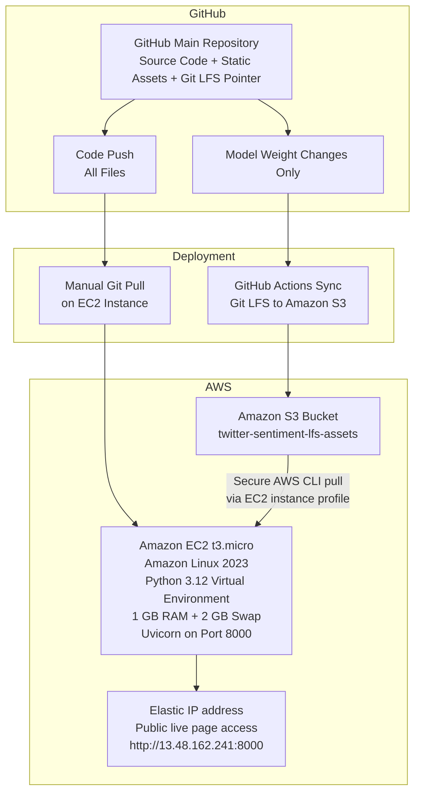

# Tweet Sentiment Analysis Platform

A production-grade, end-to-end Machine Learning web application that classifies text sentiment into Positive or Negative categories. The predictive engine utilizes a fine-tuned Hugging Face DistilBERT model implemented via PyTorch and served dynamically using a FastAPI backend architecture served through AWS.

# Live Demo

- **Public URL:** [http://13.48.162.241:8000](http://13.48.162.241:8000) 

> **Author:** Tathagata Banerjee

---

## 1. Problem Statement

The main goal of this project was to build and train an advanced deep learning model that can effectively classify the sentiment of tweets into positive or negative categories. The goal of the deep learning model was to perform sentiment analysis on a tweet dataset. The project scope included a complete machine learning cycle starting from an unlabeled dataset that required a semi-supervised approach to generate high-quality training labels. This was followed by a rigorous text data cleaning procedure that focused on the standardization of texts for the model. This was the core of the project and it involved the model implementation, training and extensive evaluation of its performance on a test dataset.

While the first iterations of the project focused on the use of Recurrent Neural Networks (RNNs) archicture with LSTM layers, the final model selected for this project was a Transformer model. More specifically, a DistilBERT model was fine-tuned for this task which was pretrained on the transformer encoder. This decision stemmed from the strong performance of transformer models for text classification problems due to their complex contextual understanding of language.

## 2. End-to-End System Architecture

This architecture decouples source application code from heavy binary deep-learning artifacts, using an automated hub-and-spoke model to stream data efficiently into a restricted cloud environment.

```text
┌────────────────────────────────────────────────────────┐
│                 GitHub Main Repository                 │
│     (Source Code + Static Assets + Git LFS Pointer)    │
└───────────┬────────────────────────────────┬───────────┘
            │                                │
 [Code Push (All Files)]          [Model Weight Changes Only]
            │                                │
            ▼                                ▼
┌──────────────────────────┐      ┌──────────────────────────┐
│     Manual Git Pull      │      │    GitHub Actions Sync   │
│      on EC2 Instance     │      │   (lfs: true -> AWS S3)  │
└─────────────┬────────────┘      └────────────┬─────────────┘
              │                                │
              │                                ▼
              │                    ┌────────────────────────┐
              │                    │    Amazon S3 Bucket    │
              │                    │   (twitter-sentiment-  │
              │                    │      lfs-assets)       │
              │                    └───────────┬────────────┘
              │                                │
              │                                │ [Secure Native AWS CLI Pull]
              │                                │ (EC2-S3-ReadOnly-Role)
              ▼                                │ Authorized via EC2
┌─────────────────────────────────┐            │ IAM Instance Profile
│        AWS EC2 t3.micro         │◄───────────┘
│      (Amazon Linux 2023)        │
│ ─────────────────────────────── │
│ [Venv] Python 3.12              │
│ [RAM]  1GB Physical + 2GB Swap  │
│ [Port] 8000 (Uvicorn Daemon)    │
│        [Local Service]          │
└───────────────┬─────────────────┘
                │
                │ [Public Browser Access]
                ▼
┌─────────────────────────────────┐
│  AWS Elastic IP (Public UI)     │
│      13.48.162.241:8000         │
└─────────────────────────────────┘
```



### 2.1 Strategic Infrastructure Decisions

PyTorch-Native Weights (safetensors): Dropped traditional Python serialization (.pkl) to protect against arbitrary code execution vulnerabilities and speed up weight initialization times at startup.

IAM-Driven Asset Delivery: The EC2 host instance pulls compiled weights (model.safetensors) dynamically via the AWS CLI. Access is controlled through an attached IAM Instance Profile (EC2-S3-ReadOnly-Role) containing explicit AmazonS3ReadOnlyAccess permissions, removing the need for hardcoded credentials on the server.

Isolated Production Sockets: The backend service is restricted to localhost loops within its private shell layer, running under a Uvicorn daemon bound to standard default Port 8000.

### 2.2 Key Architectural Decisions:
* **Decoupled Model Artifacts:** Moved away from rigid, version-dependent serialization formats (`.pkl`). The app saves and loads native PyTorch tensor formats (`model.safetensors`), configurations, and structural tokenizers entirely separately at initialization.
* **Hybrid Asset Sync Pipeline:** The standard repository tracks a heavy transformer model file (`>100MB`) via Git LFS. To eliminate the overhead of hosting a Git LFS agent on a resource-constrained production node, a targeted GitHub Actions pipeline intercepts changes to `.safetensors`, pulling the native asset and caching it inside an Amazon S3 bucket (`twitter-sentiment-lfs-assets`).
* **Secure Cloud Extraction:** The AWS EC2 deployment node extracts the model binary directly from the cloud bucket utilizing native AWS CLI binaries, authorized via an explicit IAM Instance Profile Policy (`EC2-S3-ReadOnly-Role`), bypassing the need to store hardcoded static cloud access keys.

---

### 2.3 Repository Structure

```text
project/
├── .github/
│   └── workflows/
│       └── deploy.yml                  # Conditional S3 asset sync engine
├── app/
│   ├── app.py                          # Primary FastAPI router and template endpoints
│   ├── predictor.py                    # Model loading, tokenization, and inference routines
│   ├── preprocess.py                   # Custom RegEx clean & linguistic normalizer matching notebook
│   ├── static/
│   │   └── style.css                   # Frontend web form style file
│   └── templates/
│       └── index.html                  # Frontend web form user interface
├── images/
│   └── ...                             # Training graph images for README visuals
├── model_artifacts/
│   ├── config.json                     # Model structural architecture properties
│   ├── model.safetensors               # Pinned PyTorch model state-dict weights
│   ├── tokenizer_config.json           # Hugging Face tokenizer constraints
│   ├── vocab.txt                       # WordPiece vocabulary indices mapping
│   ├── special_tokens_map.json         # Out-of-vocabulary and token boundary definitions
│   └── label_map.json                  # Numerical ID mappings to Positive/Negative
├── notebooks/
│   └── ...                             # Experimental trial-and-error notebooks during training 
├── .gitattributes                      # Git LFS tracking rules
├── .gitignore                          # Git ignore rules
├── README.md                           # Project documentation
├── Sentiment_Analysis_Deployed_code.ipynb  # Final training notebook
└── requirements.txt                    # Constrained system dependency definition
```

## 3. Data Pipeline & Semi-Supervised Engineering

High-quality annotations were generated from a raw dataset (Tweets_unlabelled.csv) using a programmatic, semi-supervised data enrichment pipeline.
```text
┌───────────────────┐      ┌──────────────────┐      ┌────────────────────┐      ┌───────────────────────┐
│ Raw Unlabeled Text│ ───> │ VADER Sentiment  │ ───> │ Meticulous Manual  │ ───> │ Ground Truth Dataset  │
│  (2,000 Records)  │      │ Automated Lexicon│      │  Audit/Correction  │      │(manually_labelled.csv)│
└───────────────────┘      └──────────────────┘      └────────────────────┘      └───────────────────────┘
```
### 3.1 Preprocessing Engine (preprocess.py)
To ensure mathematical prediction consistency, incoming evaluation requests are normalized using the exact regular expression pipeline applied during model training:

* **URL Neutralization:** Removes web links (http\S+|www\S+) to eliminate non-semantic text noise.

* **Handle Isolation:** Swaps user mentions (@username) with a generic token (@user) to generalize social interaction structures.

* **Hashtag Preserving Cleansing:** Strips the hash symbol (#) while maintaining the underlying phrase structure to extract trending keyword context.

* **Vocabulary Standardization:** Forces lowercase casting and collapses multi-character spaces to align with the core vocabulary file.

## 4. Model Architecture & Fine-Tuning Performance

The application leverages a fine-tuned DistilBERT base model (distilbert-base-uncased). This architecture provides a robust context-aware vocabulary system while utilizing a streamlined transformer head that runs efficiently on CPU servers.

### 4.1 Dynamic Memory Tokenization: 
Instead of loading tokenized tensors into memory all at once, text arrays are managed through a custom PyTorch object (SentimentDataset). This architecture feeds tokenized batches on-demand during pipeline iterations

### 4.2 Fine-Tuning Hyperparameters:
    Optimizer: AdamW (β1​=0.9, β2​=0.999, ϵ=10−8)
    Learning Rate: 5×10−5 (Preserves pre-trained structural weights)
    Batch Size: 16 (Optimal memory footprint on low-resource environments)
    Loss Metrics Function: PyTorch CrossEntropyLoss computed over raw outputs (logits)
    Regularization Loop: Early Stopping (Patience = 1, monitored against Validation Loss)

### 4.3 Training Diagnostics & Reversion Log

The model was fine-tuned over 10 epochs. Early stopping triggered at Epoch 4 when validation loss began to climb, and the pipeline automatically reverted to the optimal parameters from Epoch 2.

| Epoch | Train Loss | Val Loss | Val Accuracy | Status |
| --- | ---: | ---: | ---: | --- |
| 1 | 0.5765 | 0.3362 | 87.02% | - |
| 2 | 0.3060 | 0.2750 | 90.84% | Optimal Model Recovered |
| 3 | 0.1392 | 0.3335 | 88.55% | - |
| 4 | 0.0622 | 0.3751 | 88.80% | Early Stopping Intervened |

### 4.4 Final Evaluation Performance Matrix
The model achieved an overall accuracy of 90.84% on a 20% holdout validation slice, displaying well-balanced classification characteristics across both target groups:

| Sentiment Target | Precision | Recall | F1-Score | Evaluation Support Count |
|---|---:|---:|---:|---:|
| Negative (Class 0) | 0.92 | 0.91 | 0.91 | 202 |
| Positive (Class 1) | 0.90 | 0.91 | 0.91 | 191 |
| Overall Accuracy |  |  | 0.91 | 393 |
| Macro Average | 0.91 | 0.91 | 0.91 | 393 |
| Weighted Average | 0.91 | 0.91 | 0.91 | 393 |

# 5. Production Engineering: Problems and Fix

This matrix outlines the specific environmental obstacles encountered when porting deep learning pipelines from a local local Windows environment onto a resource-constrained Free-Tier cloud host (t3.micro, 1 GB RAM) running Amazon Linux 2023, along with their respective engineering solutions.

| Problem Encountered | Production-Grade Fix | Gist |
|---|---|---|
| OS Platform Pollution: Local Windows dependencies (`winloop`, `mpi4py`, `pywin32`) instantly crashed wheel compilation loops on Linux targets. | Isolated Environment Markers: Purged redundant modules and isolated active ecosystem dependencies directly in `requirements.txt` via conditional platform scopes (`sys_platform == 'win32'`). | "Isolated runtime environments by scrubbing developer machines' local package leaks using environment markers." |
| Out of Memory (OOM) Crashes: Heavy structural dependencies (`torch`, `transformers`) routinely exhausted the native 1 GB RAM allocation, dropping SSH terminals. | Virtual RAM Allocation: Provisioned a targeted 2 GB Swap Space file (`/swapfile`) directly onto the primary storage host, establishing an overhead buffer to survive memory spikes. | "Prevented Linux OOM-killer terminal crashes by provisioning a 2 GB active swap file to absorb initialization memory spikes." |
| Storage Cache Exhaustion: Compiling dense wheels threw `Errno 28` execution failures due to filling up the restricted memory-backed `/tmp` target directory. | Alternative Scratchpad Routing: Remapped internal package compiler locations to a persistent workspace directory (`TMPDIR=~/pip_tmp`) and expanded root EBS volumes to 20 GB. | "Re-routed pip's background build storage paths away from restricted directories into an expanded persistent EBS block volume." |
| Massive CUDA Footprint Bloat: Standard deep learning wheels pull multi-gigabyte GPU acceleration drivers by default, completely overwhelming small server storage. | CPU-Optimized Wheel Stripping: Configured custom index headers inside the dependency manifest to force-install lightweight CPU-only target wheels (`+cpu`). | "Optimized our target server footprint by stripping out multi-gigabyte CUDA GPU drivers in favor of lightweight CPU inference dependencies." |

# 6. Deployment Runbook
```text
┌─────────────────────────┐     ┌─────────────────────────┐     ┌─────────────────────────┐     ┌─────────────────────────┐
│  1. Provision Runtime   │───> │  2. Clean Assembly      │───> │  3. Hydrate Weights     │───> │  4. Spawn Background    │
│  (Venv Setup & Python)  │     │  (Non-Cached Pip Build) │     │  (Native S3 Pull)       │     │  (Uvicorn Daemon Entry) │
└─────────────────────────┘     └─────────────────────────┘     └─────────────────────────┘     └─────────────────────────┘
```
### 6.1. Provision Host Runtime
Isolated system dependencies and constructed a clean sandboxed virtual runtime block inside the cloud terminal shell.

### 6.2. Clean Assembly Injection
Directed compile paths into the custom scratch storage folder to safeguard limited cache space and installed production requirements without storing redundant disk cache.

### 6.3. Hydrate Compiled Weights
Leveraged the host instance's attached IAM Profile role to fetch the compiled machine learning weights securely from the AWS S3 without storing static access keys.

### 6.4. Spawn Production Daemon
Executed the Uvicorn application loop inside a detached background process to ensure deployment availability continues uninterrupted after active SSH terminal sessions close in rhe EC2.

## 7. CI/CD Automation Pipeline Strategy

Dynamic binary management is fully automated via integrated GitHub Actions triggers. To maximize workflow execution efficiency and eliminate unnecessary S3 API resource consumption, the workflow features conditional path-filtering. Push events containing static changes (such as modifications to frontend HTML templates, CSS styles, or python app logic) completely bypass S3 execution loops. The deployment pipeline wakes up only when true structural transformations occur within the binary file path itself (model_artifacts/model.safetensors).

## 8. Executive Summary & Impact Metrics

This project transitions a deep learning research notebook into a high-availability cloud service. By redesigning the data ingestion layer and applying strict production engineering principles, the application runs efficiently on a Free-Tier AWS cloud node.

* **Final Production Accuracy:** 90.84% (An improvement over legacy LSTM baselines).

* **Production Footprint Optimization:** Reduced PyTorch memory consumption by ~90% on the production node by forcing CPU-bound inference execution paths (+cpu wheel bindings) and eliminating multi-gigabyte CUDA runtime driver packages.

* **Dynamic Data Pipelining:** Swapped raw in-memory tensor arrays with an asynchronous PyTorch Dataset streaming generator, mitigating Out-Of-Memory (OOM) compiler crashes during resource-constrained deployments.

* **Zero-Overhead Binary Streaming:** Bypassed native Git LFS installation constraints on the cloud node by engineering an automated hub-and-spoke deployment pipeline using GitHub Actions and Amazon S3.

### 9. Limitations and Future Work

While the results of this project are encouraging, several areas present opportunities for further refinement and development:

* **Enlarging the Training Corpus:** The model's performance is fundamentally tied to the dataset it was trained on. A future iteration of this work would benefit significantly from expanding the corpus to 5,000-10,000 labeled tweets to improve the model's generalizability and accuracy across more diverse language.
* **NGINX Reverse Proxy Management:** Encapsulate backend server exposure by intercepting incoming public HTTP Port 80 requests and routing traffic down onto local sockets safely.
* **Multi-Application Single-IP Aggregation:** Implement clean micro-routing proxy layers to serve static frontend portfolio landing spaces alongside distinct decoupled internal applications from a single cloud host instance.
* **Containerization (Docker Infrastructure):** Package the runtime layers, deterministic environmental constraints, and compiled dependencies into immutable isolated images to abstract away variations between local machines and remote servers.